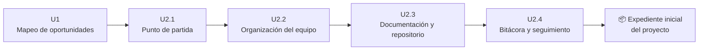
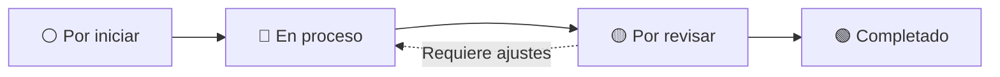
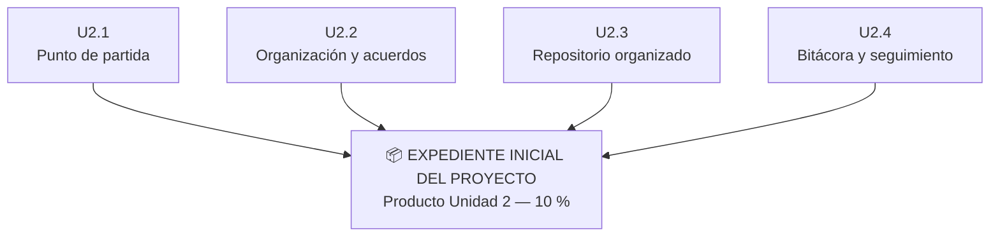

# Unidad 2 — Organización y documentación del proyecto

## 🎯 ¿Qué haremos en esta unidad?

En esta unidad cada equipo comenzará a organizar formalmente el proyecto seleccionado a partir del **Mapeo de oportunidades de la Unidad 1**.

Todavía **no buscamos diseñar la solución**.

Primero necesitamos:

- comprender mejor el punto de partida del proyecto;
- organizarnos como equipo;
- organizar la documentación;
- comenzar a registrar decisiones y avances.

El resultado será el:

> ## 📦 Expediente inicial del proyecto
> **Producto de la Unidad 2 — 10 %**

---

## 🧭 ¿Cómo está organizada la Unidad 2?

La **Actividad 2** contiene las instrucciones generales y las cuatro tarjetas permiten desarrollar y dar seguimiento al trabajo paso a paso.



Cada tarjeta genera un **subentregable** que contribuye a construir el producto final.

| Tarjeta | Subentregable |
|---|---|
| **U2.1** | Punto de partida del proyecto |
| **U2.2** | Organización y acuerdos del equipo |
| **U2.3** | Estructura documental y repositorio organizado |
| **U2.4** | Bitácora inicial y seguimiento del proyecto |

---

# 🚦 ¿Por dónde empezamos?

### 1️⃣ Primero: revisen la Actividad 2

👉 [**Actividad 2 — Organización y documentación del proyecto**](ENLACE-A-LA-ACTIVIDAD-2)

La Actividad 2 explica **qué deben realizar y cuál es el producto final de la unidad**.

---

### 2️⃣ Después: trabajen con las tarjetas

Las tarjetas indican **qué trabajo realizar en cada etapa y cómo saber cuándo está terminado**.

👉 [**U2.1 — Establecer el punto de partida del proyecto**](ENLACE-U2.1)

👉 [**U2.2 — Organizar el equipo para iniciar el proyecto**](ENLACE-U2.2)

👉 [**U2.3 — Organizar la documentación y el repositorio**](ENLACE-U2.3)

👉 [**U2.4 — Iniciar la bitácora y seguimiento**](ENLACE-U2.4)

> ⚠️ Estas son las **tarjetas modelo de la profesora**.  
> Cada equipo deberá crear sus propias tarjetas en el repositorio de su proyecto.

---

# 🗂️ ¿Cómo utilizamos una tarjeta?

Cada equipo deberá crear en su repositorio un **Issue** a partir de la tarjeta modelo correspondiente.

Después, la tarjeta irá avanzando en el tablero Kanban:



### ¿Qué significa cada estado?

| Estado | Significado |
|---|---|
| **Por iniciar** | El equipo todavía no comienza la actividad. |
| **En proceso** | El equipo está trabajando en ella. |
| **Por revisar** | El equipo considera que terminó y solicita revisión. |
| **Completado** | La actividad fue revisada y aceptada. |

Si durante la revisión se solicitan cambios:

**Por revisar → En proceso → Por revisar**

---

# 🔄 ¿Qué hacemos dentro de cada tarjeta?

No utilicen la tarjeta únicamente para leer las instrucciones.

Durante el trabajo deberán:

1. mover la tarjeta a **En proceso** cuando comiencen;
2. trabajar en los documentos y evidencias correspondientes;
3. realizar commits con mensajes descriptivos;
4. marcar el checklist conforme completen el trabajo;
5. utilizar comentarios para registrar dudas, acuerdos o información relevante;
6. agregar los enlaces solicitados;
7. mover la tarjeta a **Por revisar** cuando consideren que está terminada.

> **Mover una tarjeta a “Por revisar” significa que el equipo considera que cumplió los requisitos y solicita la revisión de la profesora.**

---

# 📁 ¿Dónde quedará nuestro trabajo?

El repositorio tendrá inicialmente esta estructura:

```text
Nombre-del-proyecto/
│
├── README.md
│
├── docs/
│   └── expediente-inicial.md
│
├── bitacora/
│   └── decisiones.md
│
└── evidencias/
```

Esta estructura es **inicial**.

Podrá crecer posteriormente de acuerdo con las necesidades reales de cada proyecto.

---

# 👥 Trabajo colaborativo

GitHub deberá permitir observar cómo participa el equipo y cómo evoluciona el proyecto.

Por ello:

- todos los integrantes deberán participar;
- cada integrante deberá utilizar su propia cuenta;
- las contribuciones deberán poder identificarse mediante commits;
- los mensajes de los commits deberán describir los cambios realizados;
- las decisiones relevantes deberán quedar documentadas;
- las tarjetas deberán mantenerse actualizadas.

No es necesario que todos realicen exactamente el mismo tipo o cantidad de trabajo.

---

# ⚠️ Recuerden

En esta unidad estamos **comprendiendo, organizando y documentando el proyecto**.

Todavía:

❌ no necesitamos tener definida la solución;

❌ no necesitamos decidir todos los componentes o tecnologías;

❌ no debemos asignarnos especialidades técnicas que todavía no tenemos;

❌ no debemos presentar suposiciones como hechos;

❌ no necesitamos resolver todas las preguntas identificadas.

Sí necesitamos:

✅ reconocer qué sabemos;

✅ identificar qué necesitamos investigar o verificar;

✅ organizarnos como equipo;

✅ documentar nuestro trabajo;

✅ dejar evidencia de cómo evoluciona el proyecto.

---

## 🏁 Al terminar la Unidad 2

Las cuatro tarjetas deberán permitir construir:



Este expediente será el punto de partida para continuar con las siguientes etapas del proyecto.
